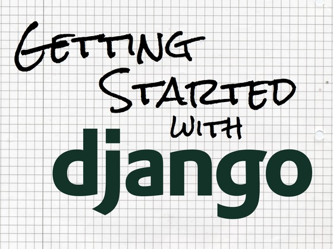

---

# Por que Plone?

- Homologado no governo Brasileiro desde ~2003
- Segurança
- Desempenho
- Baixa vulnerabilidade
- Indexão (Busca avançada)
- Foco em conteudo
- Acessibilidade (Não só uma norma, é uma lei)
- ... (Poderia ficar falando horas e horas o por que usamos Plone)

---

# Vulnerabilidades

Blog post (Referência): [Gov 2.0 guide to Plone](http://govfresh.com/2011/03/gov-2-0-guide-to-plone/)

---

# Vulnerabilidades

Blog post (Referência): [Vulnerabilidades nos principais CMS's do mercado nos últimos 5 anos](http://www.simplesconsultoria.com.br/blog/vulnerabilidades-nos-principais-cmss-do-mercado-nos-ultimos-5-anos)

---

# Performance (Requests)

Referência: [Significant performance improvements](http://plone.org/products/plone/features/faster)

---

# Evolução

Referência: [Significant performance improvements](http://plone.org/products/plone/features/faster)

---

# Evolução

Referência: [Significant performance improvements](http://plone.org/products/plone/features/faster)

---

# PloneConf 2012

---

# Por que não Django?

Blog post (Referência): [Plone para desenvolvedores Python](http://avelino.us/2012/08/30/plone-para-desenvolvedores-python/)

---

# Mas temos o Django CMS

- Django CMS existe desde ~2007
- Plone existe desde ~2001

---

